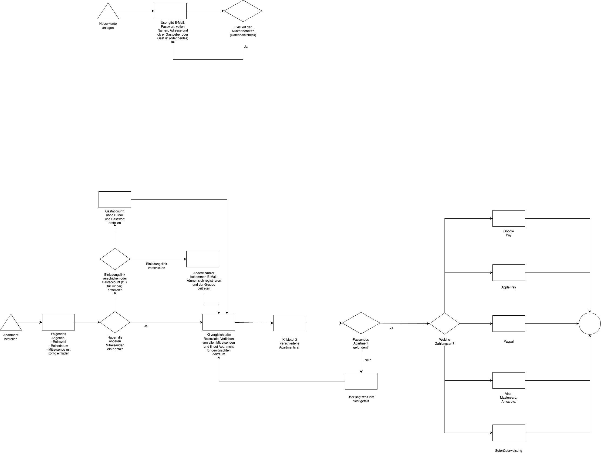

# Process View

## Business Process Model

## Main Business Processes

### User Registration

- Users sign up as guests or hosts
- Email verification and profile setup
- Platform onboarding

### Property Management (Hosts)

- Create property listings with details and photos
- Set availability and pricing
- Manage bookings and guest communication

### Booking Process (Guests)

- Search and filter properties
- View property details and availability
- Make booking requests and payments
- Communication with hosts

### Reviews and Ratings

- Post-stay review system
- Mutual rating between guests and hosts
- Quality assurance and feedback loop
