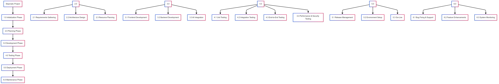

# Work Breakdown Structure View

This section describes the project's Work Breakdown Structure (WBS) and the roles necessary for its implementation.

## 1. Project Phases (Phase-Oriented WBS)

Below is a graphical representation of the project phases, organized as a phase-oriented Work Breakdown Structure. This WBS highlights the major stages the project will go through.

## 2. Project Team Roles and Functions

The following roles are essential for the Staymatic project:

- Project Leader/Manager
- Software Developers (Frontend & Backend)
- AI/Machine Learning Engineer
- Quality Assurance (QA) Engineer/Tester
- UI/UX Designer
- DevOps Engineer
- Database Administrator (DBA)
- Security Specialist
- Stakeholder Representative
- Technical Writer/Documentarian
